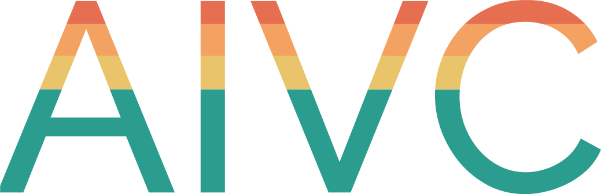

  stands for <b>AI</b>-based <b>V</b>ideo <b>C</b>odec. It is an <b>end-to-end neural video coder</b>, offering many practical features and a great flexibility.

 

| __Features__                | __What's inside?__  |
| :---:                   | :-: |
| Coding configurations   | Random Access, Low-delay P & All Intra |
| Tunable Intra Period    | Up to 64
| Tunable GOP size        | Up to 64
| 7 Different rates target   | 1 MBit/s to 20 MBit/s (for 1080p videos)
| Competitive performances| On par with HM (HEVC Test Model)
| Convenient input format | 8-bit YUV 4:2:0 videos

---

  

